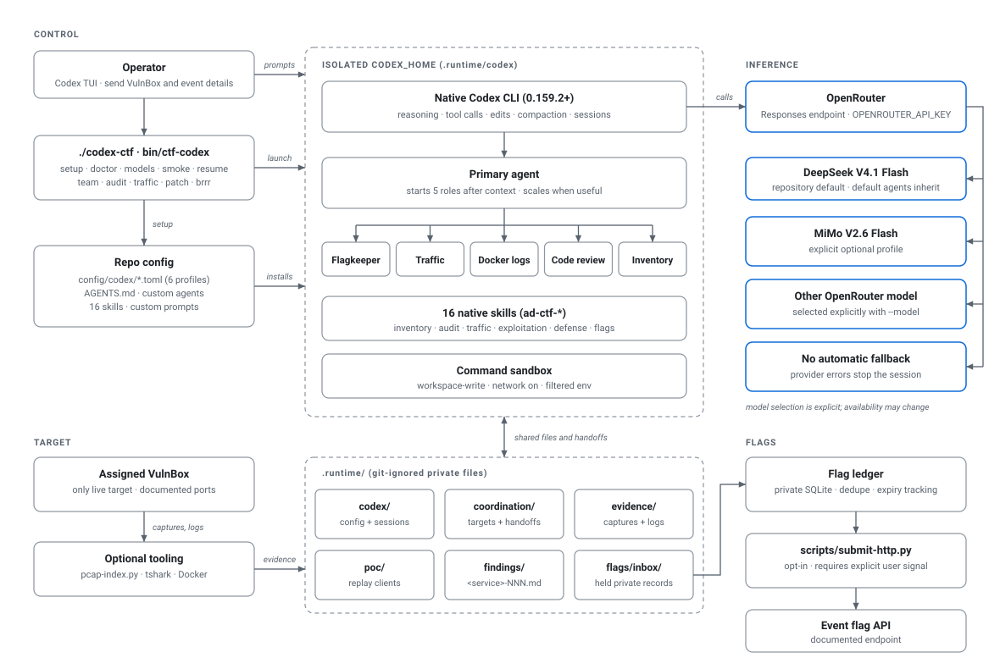

# codex-ctf

A Codex CLI setup for authorized attack/defense CTF work. It starts an agent team, gives each specialist a clear job, and keeps traffic evidence, findings, patches and captured flags in a private workspace.

**Codex is the harness.** It runs the agent loop, tools, sessions and native subagents. This repository supplies configuration, prompts, skills and small local utilities. It does not run a separate orchestrator or model router. All configured model requests use OpenRouter's Responses API.

## Quick start

Requirements: Codex CLI 0.159.2+ and Bash 3.2+. Python 3.9+ is used for local evidence tools and tests. Docker and TShark are optional.

```bash
git clone https://github.com/ashwnn/codex-ctf.git
cd codex-ctf
export OPENROUTER_API_KEY="..."
./codex-ctf
```

The launcher creates `workspaces/default/`, installs an isolated Codex configuration in `.runtime/codex/`, and opens the native Codex terminal UI. Your regular `~/.codex` setup is left alone. You can also put the key in `.runtime/secrets/openrouter.key` with `0600` permissions. Do not commit keys, challenge data or flags.

For a named service:

```bash
bin/ctf-codex init my-service
# Add deployed source to workspaces/my-service/source/ and captures to evidence/raw/.
# Fill in service.toml, team.toml, and verification/checker-contract.md from
# published event documentation and bounded observations.
bin/ctf-codex team --workspace workspaces/my-service
```

The default model is `deepseek/deepseek-v4.1-flash`, selected as a provisional throughput-and-cost baseline with ZDR-eligible OpenRouter routes. Five specialist roles have native Codex model overrides for evaluation; their assignments are hypotheses until paid comparisons can run. Use `bin/ctf-codex models` for model/key metadata and `bin/ctf-codex models --zdr MODEL...` to inspect eligible endpoints. OpenRouter account/key ZDR enforcement is configured separately; the endpoint list cannot verify it. See [model selection and the $60 budget](docs/model-selection.md).

## How the harness works



1. **Launcher:** `bin/ctf-codex` installs the repository's config, custom agents, prompts and skills under an isolated `CODEX_HOME`, chooses a profile and starts Codex. Shell and Python do not choose agent actions.
2. **Codex:** The native agent loop sends model requests through the selected OpenRouter provider, invokes local tools, and keeps the session. The `team` profile enables native subagents; other profiles run a single agent.
3. **Coordinator:** A team launch starts five children: flagkeeper, traffic, Docker logs, code review and PoC development. The coordinator assigns work, records agent IDs, relays urgent updates and keeps one code/deployment writer per service.
4. **Shared workspace:** Workers read service context, source and bounded evidence. They link results with a finding ID and write handoffs to `coordination/` and `findings/`. Raw captures and real flags stay in ignored local paths.
5. **Flagkeeper:** Producers pass inbox file paths and counts. A private SQLite ledger deduplicates flags and tracks published expiry. Submission requires a separate, explicit user signal and a configured event API.

`/prompts:brrr` inside the TUI requests an offense-focused surge. It can expand toward 20 children when there are distinct tasks, while keeping flagkeeper and checker uptime covered. `bin/ctf-codex brrr --workspace workspaces/my-service` starts a separate surge session. It does not invent targets or submit held flags.

## What is included

| Part | Purpose |
| --- | --- |
| `config/codex/` and `config/agents/` | OpenRouter provider, task profiles and native specialist roles |
| `prompts/` and `skills/` | Team, audit, traffic, patch and surge workflows; task skills selected by Codex or invoked with `$ad-ctf-*` |
| `templates/` | Service context, team settings, workspace instructions, a checker contract and a per-change patch verification record |
| `scripts/pcap-index.py` | Bounded PCAP metadata extraction with frame and stream provenance; no packet bodies |
| `scripts/flag-ledger.py` | Private flag deduplication, expiry planning and receipt tracking |
| `scripts/submit-http.py` | Optional transport adapter after matching the published API and testing locally |
| `scripts/tulip-replay.py` | One reviewed HTTP request to one exact published target, with private flag handoff and no submission |
| `scripts/operations-drill.py` | Loopback-only rehearsal of checker-shaped responses, persistence, restart and source rollback |
| `scripts/deployment.py` | Own-service immutable checkpoints, human external confirmation, explicit rollback and pending remote observations |
| `bin/ctf-codex` | Setup, launch, model checks, diagnostics and smoke test |

The skills cover inventory, service and code audit, traffic and Docker logs, reproduction, binary and crypto analysis, PoC development, defense, team coordination and flagkeeping. Use `/skills` in Codex to browse them. Use `/prompts:team`, `/prompts:audit`, `/prompts:traffic`, `/prompts:patch` or `/prompts:brrr` for the installed prompts.

## Event-day loop

1. Run `bin/ctf-codex doctor` before the event. Run `bin/ctf-codex models` to
   check the configured OpenRouter model and key budget; use `smoke` only when
   you want a live inference/tool check and accept its possible credit cost.
   Run `python3 scripts/operations-drill.py` to rehearse local persistence and
   source rollback without inference or event data.
2. Create one private workspace per service with `bin/ctf-codex init NAME`.
   Copy in only the authorized source and own-service evidence. Fill in the
   service, scope, checker contract, event API documentation path and actual
   rollback command from published material and local observation.
3. Start one interactive team session with
   `bin/ctf-codex team --workspace workspaces/NAME`. Resume it with
   `bin/ctf-codex resume --workspace workspaces/NAME --last` or replace
   `--last` with the saved Codex session ID. Use the same workspace and profile
   so the native Codex session and saved coordination handoffs stay together.
   The wrapper accepts only the native `--last` selector; provider, approval
   and remote overrides remain pinned. `--exec` runs are ephemeral and cannot
   be resumed.
4. Before a change, use one writer and a dated copy of
   `verification/patch-verification-template.md`. Compare ordinary checker
   flows, flag placement/retrieval, uptime and persistence; record the actual
   result and rollback evidence. Roll back on observed checker or uptime
   regression using the service's verified command.
5. Keep captured flags in the private inbox and use the flag ledger. Check
   `review` and `receipts` after an ambiguous submission, verify receipts from
   the event system, and reconcile by hashed ID. Submission stays on hold until
   you explicitly signal a bounded flush.

Command sandbox networking is off by default. `--network` enables network
access for workspace-write commands; use it only when the event-authorized
workflow needs it, with the published service scope and bounded traffic. It
does not validate or limit the destination. Never use the challenge VM or
supporting event infrastructure as a target.

## Common commands

```bash
bin/ctf-codex doctor                       # Validate profiles and installed assets; no inference
bin/ctf-codex models                       # Check the selected OpenRouter model
bin/ctf-codex models --zdr deepseek/deepseek-v4.1-flash xiaomi/mimo-v2.6-flash
bin/ctf-codex audit --workspace workspaces/my-service
bin/ctf-codex traffic --workspace workspaces/my-service
bin/ctf-codex patch --workspace workspaces/my-service 'Fix finding my-service-001.'
bin/ctf-codex resume --workspace workspaces/my-service --last
bin/ctf-codex smoke                        # Live model and tool-loop check; may use credits
python3 scripts/operations-drill.py       # Local checker/persistence/rollback rehearsal; no inference
python3 -m unittest discover -s tests -v
```

For human and agent deployment recovery, use `bin/ctf-codex deploy --help` and
the [checkpoint configuration and human-patch runbook](docs/deployment-checkpoints.md).
The deterministic CLI requires no Codex/model invocation. It records the exact
running commit/artifact, configured functional checks and a human's external
leaderboard observation before creating an immutable `stable-deploy-NNN` tag.
Optional remote polling records pending commits only. `$ad-ctf-deployment` covers
predeployment notices, explicit rollback, failure recovery and unconfirmed
external status; local health cannot establish an external checker pass.

For flag operations, the ledger defaults to `flags/ledger.sqlite3`; pass a
workspace-local database path for a named service. `review` and `receipts`
show only hashed IDs and receipt metadata, never flag values:

```bash
python3 scripts/flag-ledger.py --db workspaces/my-service/flags/ledger.sqlite3 status
python3 scripts/flag-ledger.py --db workspaces/my-service/flags/ledger.sqlite3 review
python3 scripts/flag-ledger.py --db workspaces/my-service/flags/ledger.sqlite3 receipts --id SHA256_ID
```

For one validated Tulip replay, keep the raw request and published-target list
private in the service workspace. Put one exact published proxy base URL per
line in `scope/published-targets.txt`, then run from that workspace so the tool
writes captured values only to its private `flags/inbox/`:

```bash
(cd workspaces/my-service && python3 ../../scripts/tulip-replay.py \
  --request evidence/raw/tulip-request.raw \
  --published-targets scope/published-targets.txt \
  --target https://published-proxy.example \
  --flag-id CURRENT_PUBLIC_FLAG_ID \
  --service my-service --team TEAM_ID \
  --flag-regex 'EVENT_FLAG_PATTERN' --source finding-001)
```

This makes one request and prints only status, count and inbox path. It does
not discover targets or submit flags. Reproduce against a synthetic local copy
first and use the published checker/API contract for each event.

The `team` profile uses low reasoning effort by default. `audit` and `patch` use high effort. `cheap` and `traffic` use low effort. `deepseek-cheap` and `deepseek-audit` explicitly select DeepSeek V4.1 Flash through OpenRouter. Set a different profile with `--profile` or a model with `--model VENDOR/MODEL`.

Command tools run in Codex's workspace-write sandbox with network off by default. This limits tool execution, not what is sent to the selected model provider: model-visible snippets and tool output go to OpenRouter. Review and redact evidence before giving it to Codex. The local workspace is Git-ignored, but it is not an OS security boundary. An interactive session may still ask for native sandbox escalation.

For design details and operational assumptions, see [design decisions](docs/design.md), [model selection](docs/model-selection.md), the [A/D operating map](docs/ad-playbook.md), the [verification record](docs/verification.md), and the [handoff checklist](HANDOFF.md). Actual service targets and event API details must come from the event, not these templates.
